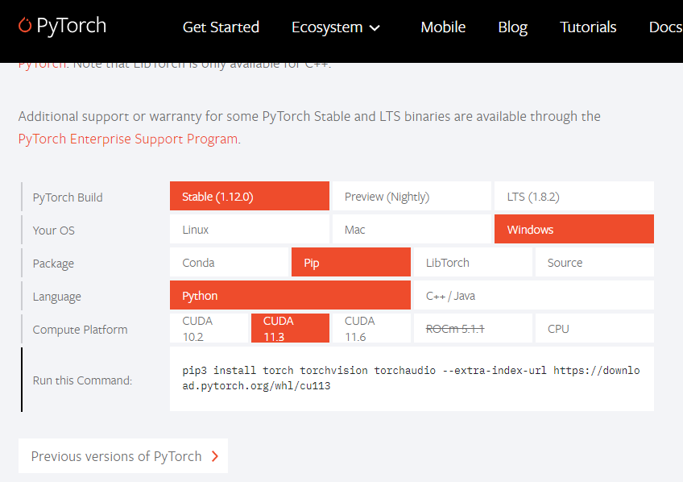
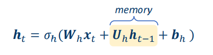
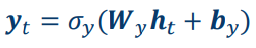
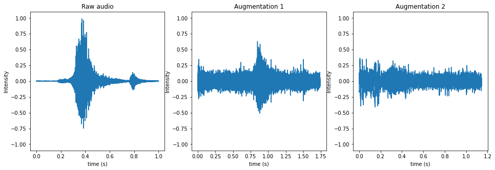
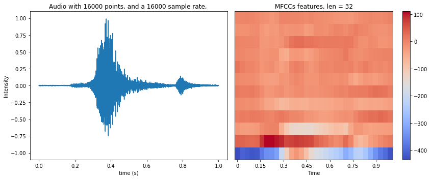
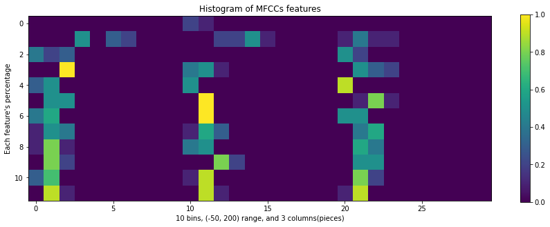
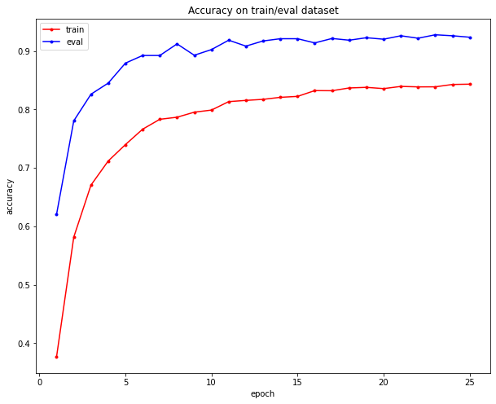
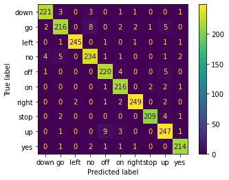

# Speech Recognition with Pytorch using Recurrent Neural Networks

Hello, today we are going to create a neural  network with **Pytorch** to classify the voice. 


In the previous blog post we have studied this case by using **Tensorflow**  with Convolutional Neural networks.

This time we will use **LSTM** (Long Short-Term Memory) is adopted for classification, which is a type of **Recurrent Neural Network**.

### Installation of Conda

First you need to install anaconda at this [link](https://www.anaconda.com/products/individual)


in this location **C:\Anaconda3** , then you, check that your terminal , recognize **conda**

```
C:\conda --version
conda 4.12.0
```

## Environment creation

The environments supported that I will consider is Python 3.7, 

I will create an environment called **keras**, but you can put the name that you like.

```
conda create -n pytorch python==3.7
```

and then close and open the terminal

```
conda activate pytorch  
```

You will have something like this:

```
Microsoft Windows [Version 10.0.19044.1706]
(c) Microsoft Corporation. All rights reserved.
C:\Users\ruslanmv>conda activate keras
(pytorch) C:\Users\ruslanmv>
```

then in your terminal type the following commands:

```
conda install ipykernel
```

then

```
python -m ipykernel install --user --name pytorch --display-name "Python (Pytorch)"
```

Then we install **Pytorch**,  from the original source "https://pytorch.org/" we can install the one that matches with your computer.



To know the cuda version

```
nvcc --version
```

you can have see this

```
nvcc: NVIDIA (R) Cuda compiler driver
Copyright (c) 2005-2021 NVIDIA Corporation
Built on Wed_Jul_14_19:47:52_Pacific_Daylight_Time_2021
Cuda compilation tools, release 11.4, V11.4.100
Build cuda_11.4.r11.4/compiler.30188945_0
```

I'm using Stable(1,12), Windows Pip, Python 3.7, CUDA 11.3

```
pip3 install torch torchvision torchaudio --extra-index-url https://download.pytorch.org/whl/cu113
```

If you will work with **Data Science Audio Projects** I suggest install additional libraries:

```
pip install  matplotlib sklearn scipy numpy  jupyter opencv-python
```

with some  audio packages 

```
pip install librosa soundfile  pynput sounddevice gtts pyttsx pyttsx3 
```

then open the **Jupyter notebook** with the command

```
jupyter notebook&
```

then click New and Select your Kernel called **Python (Pytorch)**

And now we are ready to start working.


# Recurrent neural networks

The goal of this project is to implement an audio classification system, which: 

1. First reads in an audio clip (containing at most one word),
2.  Recognizes the class(label) of this audio.


### Classes  

10 classes are chosen, namely:   

```python
classes=["yes", "no", "up", "down", "left", "right", "on", "off", "stop", "go"]
```

where "yes" means the audio contains the word "yes", etc. 

### Method  

Features: MFCCs (Mel-frequency cepstral coefficients) are computed from the raw audio. You can think of it as the result of fouriour transformation.

Classifier: LSTM (Long Short-Term Memory) is adopted for classificatioin, which is a type of Recurrent Neural Network.

The model was pretrained on the [Speech Commands Dataset](https://ai.googleblog.com/2017/08/launching-speech-commands-dataset.html) with intensive data augmentation, including "shift", "amplify", "superpose noise", etc.     


## Sequential data 

In audio and speech processing, we often deal with sequential data. A waveform is a sequence of sample points 


Fig. Example of a discrete Fourier analysis of a sum of cosine waves at 10, 20, 30, 40, and 50 Hz


The output of  Short-time Fourier transform (STFT ) is a sequence of Fast Fourier transform (FFT) coefficients. after feature extraction, we get a sequence of acoustic features such as MFCC. Mel-frequency cepstral coefficients (MFCCs) are coefficients that collectively make up an MFC. They are derived from a type of  cepstral representation of the audio clip (a nonlinear "spectrum-of-a-spectrum"). 


Fig. A spectrogram visualizing the results of a STFT of the words "nineteenth century". Here frequencies are shown increasing up the vertical axis, and time on the horizontal axis. The legend to the right shows that the color intensity increases with the density.

In engineering applications, the Fourier series is generally presumed to converge almost everywhere (the exceptions being at discrete discontinuities) since the functions encountered in engineering are better-behaved than the functions that mathematicians can provide as counter-examples to this presumption. 


Four partial sums (Fourier series) of lengths 1, 2, 3, and 4 terms, showing how the approximation to a square wave improves as the number of terms increases. where  the Fourier transform by the integral formula


## What’s special about sequential data? 

It has a time dimension.

- The sequence can be long 
- The length of the sequence can be unknown

- Reusing parameters 


 Same information can repeat at different positions in the sequence 

 Example of speech recognition:

 • Utterance 1: “Today is a nice day.”

 • Utterance 2: “What’s the weather today?” 

The same word “today” appears at different positions in two utterances

 The parameters to recognize the word “today” should be reused

 In short, we want to make better use of temporally repeated information

## Having memory 

Example of speech recognition: 

• Utterance 1: “What is the weather today?” 

• Utterance 2: “I don’t know whether I should go.” 

• The word “weather” and “whether” have the same pronunciation

 • Speech recognition requires the context

 • The context can be modeled via memory

The output at time 𝑡 depends on the states at time 𝑡 − 1 

• The hidden states:



The output:



where:

 • 𝜎ℎ ⋅ : activation function for hidden states 

• 𝜎𝑦(⋅): activation function for outputs

 • {𝑾ℎ, 𝑼ℎ, 𝒃ℎ,𝑾𝑦, 𝒃𝑦}: time-independent parameters

 • Usually we assume 𝒉0 = 0


We will build an LSTM-based speaker recognition system from scratch.

## How Does Recurrent Neural Networks Work?

In Recurrent Neural networks, the information cycles through a loop to the middle hidden layer.


**Fig: Working of Recurrent Neural Network**

The input layer ‘x’ takes in the input to the neural network and processes it and passes it onto the middle layer. 

The middle layer ‘h’ can consist of multiple hidden layers, each with its own activation functions and weights and biases. If you have a neural network where the various parameters of different hidden layers are not affected by the previous layer, ie: the neural network does not have memory, then you can use a recurrent neural network.

The Recurrent Neural Network will standardize the different activation functions and weights and biases so that each hidden layer has the same parameters. Then, instead of creating multiple hidden layers, it will create one and loop over it as many times as required. 


# Importing Libraries

```python
from time import sleep
from tqdm import tqdm
import os
import urllib.request
import pathlib
import shutil
import os
import librosa
import IPython.display as ipd
import matplotlib.pyplot as plt
import numpy as np
from scipy.io import wavfile
import warnings
warnings.filterwarnings("ignore")
%load_ext autoreload
%autoreload 2
import sys, os
import time
import numpy as np
import matplotlib.pyplot as plt
import scipy
import copy 
import torch
# display
import IPython.display as ipd
from IPython.core.display import HTML
from IPython.display import display, clear_output
# audio library
import librosa.display 
import shutil
```


## Step 2 Creation of some utility programs

We define some functions that allow us download the datasets that we need to use to create our ML model and train it.


```python
class DownloadProgressBar(tqdm):
    def update_to(self, b=1, bsize=1, tsize=None):
        if tsize is not None:
            self.total = tsize
        self.update(b * bsize - self.n)


def download_file(url, output_path):
    with DownloadProgressBar(unit='B', unit_scale=True,
                             miniters=1, desc=url.split('/')[-1]) as t:
        urllib.request.urlretrieve(
            url, filename=output_path, reporthook=t.update_to)
```

### 3.1.1. Speech Commands Dataset 

[Speech Commands Dataset](https://ai.googleblog.com/2017/08/launching-speech-commands-dataset.html) contains **105k audio clips** (3.3GB large) collected from lots of people.  
It has **35 classes** of words, listed as follows:  


```python
# We define some parameters
# current working directory
DIR = os.path.abspath(os.getcwd())
DATASET_DIRECTORY_PATH = DIR+'/data/speech_commands'
#DOWNLOAD_URL = 'http://download.tensorflow.org/data/speech_commands_v0.02.tar.gz'
DOWNLOAD_URL = "http://download.tensorflow.org/data/speech_commands_v0.01.tar.gz"
```

### Downloading the data and  Unzip the tar file


```python
# Check if dataset directory already exist, otherwise download, extract and remove the archive
if not os.path.isdir(DATASET_DIRECTORY_PATH):
    if not os.path.isdir(DIR+'/data'):
        os.mkdir(DIR+'/data')
    print('Downloading from ' + DOWNLOAD_URL)
    download_file(DOWNLOAD_URL, DIR+'/data/speech_commands.tar.gz')
    print("Extracting archive...")
    shutil.unpack_archive(
        DIR+'/data/speech_commands.tar.gz', DATASET_DIRECTORY_PATH)
    os.remove(DIR+'/data/speech_commands.tar.gz')
    print("Done.")
```

    Downloading from http://download.tensorflow.org/data/speech_commands_v0.01.tar.gz


    speech_commands_v0.01.tar.gz: 1.49GB [01:27, 17.0MB/s]                                                                                          


    Extracting archive...
    Done.

```python
# Delete the extra files of extracted file
# Cleaning data
if os.name == 'nt':
    print("We are on Windows")
    paths=DIR+'\data\speech_commands'
    os.chdir(paths)
    files=['testing_list.txt','validation_list.txt','LICENSE','README.md']
    for f in files:
        try:
            os.remove(f)
        except FileNotFoundError:
            continue
    #!dir
    os.chdir(DIR)
else:
    print("We are on Unix")
    extras=DIR+'/data/speech_commands/*.*'
    command='rm -rf '+ extras
    os.system(command)
    extras=DIR+'/data/speech_commands/LICENSE'
    command='rm -rf '+ extras
    os.system(command)
    #!ls ./data/speech_commands
```

    We are on Windows

```python
train_audio_path =DATASET_DIRECTORY_PATH+"/"
```


```python
# Number of recording of each voices
labels = os.listdir(train_audio_path)
print(labels)
```

    ['bed', 'bird', 'cat', 'dog', 'down', 'eight', 'five', 'four', 'go', 'happy', 'house', 'left', 'marvin', 'nine', 'no', 'off', 'on', 'one', 'right', 'seven', 'sheila', 'six', 'stop', 'three', 'tree', 'two', 'up', 'wow', 'yes', 'zero', '_background_noise_']

```python
to_remove = [x for x in labels if x not in classes]
```


```python
len(to_remove)
```


    21


```python
print(to_remove)
```

    ['bed', 'bird', 'cat', 'dog', 'eight', 'five', 'four', 'happy', 'house', 'marvin', 'nine', 'one', 'seven', 'sheila', 'six', 'three', 'tree', 'two', 'wow', 'zero', '_background_noise_']

```python
for directory in to_remove:
    noise_dir_new=DIR+'/data/'+directory
    noise_dir_old=DIR+'/data/speech_commands/'+directory
    try:
        shutil.move(noise_dir_old, noise_dir_new)
    except FileNotFoundError as e:
        pass  #folder doesn't exist, deal with it.
```


```python
# Number of recording of each voices
labels = os.listdir(train_audio_path)
print(labels)
```

    ['down', 'go', 'left', 'no', 'off', 'on', 'right', 'stop', 'up', 'yes']

```python
WORK_DIR =['data_train','checkpoints']
for DIRECTORY in WORK_DIR:
    WORK_DIRECTORY_PATH = DIR +'/'+ DIRECTORY 
    if not os.path.isdir(WORK_DIRECTORY_PATH):
        if not os.path.isdir(DIR+'/'+DIRECTORY ):
            os.mkdir(DIR+'/'+DIRECTORY )
```


```python
CONFIG_DIRECTORY_PATH = DIR+'/config'
# Check if config directory already exist, otherwise will create
import os
import shutil
if not os.path.isdir(CONFIG_DIRECTORY_PATH):
    if not os.path.isdir(DIR+'/config'):
        os.mkdir(DIR+'/config')
    print('Creating config')
    # list of names
    names = labels
    # open file in write mode
    with open(r'config/classes.names', 'w') as fp:
        for item in names:
            # write each item on a new line
            fp.write("%s\n" % item)
    print("Done.")
```

    Creating config
    Done.


### Downloading the utils and installing


```python
LIB_DIRECTORY_PATH = DIR+'/utils'
# Check if utils directory already exist, otherwise download, and install
import os
import shutil
if not os.path.isdir(LIB_DIRECTORY_PATH):
    if not os.path.isdir(DIR+'/utils'):
        os.mkdir(DIR+'/utils')
    print('Downloading utils')
    user = "ruslanmv"
    repo = "Speech-Recognition-with-RNN-Neural-Networks"
    src_dir = "utils"
    pyfile = "lib.py"
    url = f"https://raw.githubusercontent.com/{user}/{repo}/master/{src_dir}/{pyfile}"
    !wget --no-cache --backups=1 {url}
    print("Installing library...")
    shutil.move(DIR+'/lib.py', DIR +'/utils/lib.py')
    print("Done.")
```


```python
try:
    import  gtts
except ImportError as e:
    !pip install gtts
    pass  # module doesn't exist, deal with it.
```


```python
# Import all libraries
import utils.lib as lib
```

# 3. Methods

## 3.1. Training data   

These large amount of data are important for extracting the core features of a word.  
If I didn't do the pretraining on this dataset, the model will have poor performance when generalizing to other people's voices.

### 3.1.2. My dataset 

We choose 11 target classes listed as follows:  


```python
# Number of recording of each voices
labels = os.listdir(train_audio_path)
print(labels)
```

    ['down', 'go', 'left', 'no', 'off', 'on', 'right', 'stop', 'up', 'yes']

```python
len(labels)
```


    10


```python
labels=os.listdir(train_audio_path)
#find count of each label and plot bar graph
no_of_recordings=[]
for label in labels:
    waves = [f for f in os.listdir(train_audio_path + label) if f.endswith('.wav')]
    no_of_recordings.append(len(waves))
    
#plot
plt.figure(figsize=(30,5))
index = np.arange(len(labels))
plt.bar(index, no_of_recordings)
plt.xlabel('Commands', fontsize=12)
plt.ylabel('No of recordings', fontsize=12)
plt.xticks(index, labels, fontsize=15, rotation=60)
plt.title('No. of recordings for each command')
plt.show()
```


```python
#Load the audio file
if os.name == 'nt':
    print("We are on Windows")
    test_file=train_audio_path+'left/00b01445_nohash_0.wav'
    audio = lib.AudioClass(filename=test_file)
else:
    print("We are on Unix")
    test_file=train_audio_path+'left/00b01445_nohash_0.wav'
    audio = lib.AudioClass(filename=test_file)
```

    We are on Windows

```python
ipd.Audio(audio.data, rate=audio.sample_rate) # play audio
```

## 3.2. Data augmentation

Raw data goes through a serials of augmentation before training, including:  

> Shift  
> Pad zeros  
> Amplify  
> Change play speed  
> Superpose noise  

This step is essential. Raw audios in Speech Commands Dataset are all about 1 second long, and have little background noise. It can easily causes certain overfitting.  

We should try to diversify the data by data augmentation techniques, in order to get prepared for all kinds of real-world scenarios, including noise, variation of the audio length and loudness. 

**Example of audio augmentation:**


```python
# Initialize the augmenter.
#     Specify a parameter's range for generating a random augmentation.

Aug = lib.Augmenter
aug = Aug([        
    
    Aug.Shift(rate=(0, 0.2), keep_size=False), # shift data for 0~0.2 percent of the total length
    
    Aug.PadZeros(time=(0, 0.3)),  # pad zeros at one side for 0~0.3 seconds 
    
    Aug.Amplify(rate=(0.2, 1.5)), # amplify loudness by 0.2~1.5 
    
    Aug.PlaySpeed(rate=(0.7, 1.3), keep_size=False), # change play speed
    
    Aug.Noise( # Superpose noise.
        # (Noise files are pre-load and normalized)
        noise_folder="data/_background_noise_/", prob_noise=1.0, intensity=(0, 0.7)),

], prob_to_aug=1.0, # probability to do this augmentation
)
```


```python
# Read audio, do two different augmentations, and plot results
plt.figure(figsize=(16, 5))

plt.subplot(131)
audio_1 = lib.AudioClass(filename=test_file)
audio_1.plot_audio(ax=plt.gca())
plt.title("Raw audio")

plt.subplot(132)
audio_2 = copy.deepcopy(audio_1)
aug(audio_2) # augment audio
audio_2.plot_audio(ax=plt.gca())
plt.title("Augmentation 1")

plt.subplot(133)
audio_3 = copy.deepcopy(audio_1)
aug(audio_3) # augment audio
audio_3.plot_audio(ax=plt.gca())
plt.title("Augmentation 2")

plt.show()
```


​    

​    


```python
ipd.Audio(audio_1.data, rate=audio_1.sample_rate) # play audio
```


```python
ipd.Audio(audio_2.data, rate=audio_2.sample_rate)
```


```python
ipd.Audio(audio_3.data, rate=audio_3.sample_rate)
```


**Noise files for audio augmentation:**


```python
audio_noise = lib.AudioClass(filename="data/_background_noise_/doing_the_dishes.wav")
ipd.Audio(audio_noise.data, rate=audio_noise.sample_rate) # play audio
```


## 3.3. Features

The [MFCCs](https://en.wikipedia.org/wiki/Mel-frequency_cepstrum) feature is computed and fed into the classifer.

An intuitive understanding of MFCCs is: Use a sliding window on the raw data, and compute the fourior transform of each window to obtain the "loudness" on each frequency band.

The code and parameters for computing MFCCs is:

``` python
def compute_mfcc(data, sample_rate, n_mfcc=12):
    return librosa.feature.mfcc(y=data, sr=sample_rate, n_mfcc=n_mfcc)
```


```python
# A visualization of the MFCCs features is shown below:
audio.compute_mfcc()
audio.plot_audio_and_mfcc()
plt.show()
```


​    

​    


* Histogram of MFCCs is a bad feature  
  I also tested the feature of "the histogram of MFCCs", but the performance is bad, since the information of time length is lost.  
  A histogram feature is shown below. It's computed piece-wisely of 3 pieces on a MFCCs:


```python
audio.compute_mfcc_histogram(bins=10, binrange=(-50, 200), col_divides=3)
audio.plot_mfcc_histogram() # After experiment, I found that this feature is bad. Don't use it.
```


​    

​    


# 3.4. Classifier

The input audio has a varying length, thus the feature's length also varies.  
To deal with such cases, I adopted the LSTM (Long short-term memory) for classification.  
The main paramters are set as: 3 layers and 64 states in each layer.  
The code is copied from [here](https://github.com/yunjey/pytorch-tutorial/blob/master/tutorials/02-intermediate/recurrent_neural_network/main.py).

```python
import sys, os
ROOT=DATASET_DIRECTORY_PATH
sys.path.append(ROOT)
import numpy as np 
import torch 
```


```python
import numpy as np 
import time
import types
import matplotlib.pyplot as plt 

import torch 
import torch.nn as nn
import torchvision
import torchvision.transforms as transforms
from torch.utils.data import Dataset
```


```python
def set_default_args():
    
    args = types.SimpleNamespace()

    # model params
    args.input_size = 12  # == n_mfcc
    args.batch_size = 1
    args.hidden_size = 64
    args.num_layers = 3

    # training params
    args.num_epochs = 100
    args.learning_rate = 0.0001
    args.learning_rate_decay_interval = 5 # decay for every 5 epochs
    args.learning_rate_decay_rate = 0.5 # lr = lr * rate
    args.weight_decay = 0.00
    args.gradient_accumulations = 16 # number of gradient accums before step
    
    # training params2
    args.load_weights_from = None
    args.finetune_model = False # If true, fix all parameters except the fc layer
    args.device = torch.device('cuda' if torch.cuda.is_available() else 'cpu')
    
    # data
    args.data_folder = "data/data_train/"
    args.train_eval_test_ratio=[0.9, 0.1, 0.0]
    args.do_data_augment = False

    # labels
    #args.classes_txt = "config/classes.names" 
    args.classes_txt =labels
    args.num_classes = None # should be added with a value somewhere, like this:
    #                = len(lib.read_list(args.classes_txt))

    # log setting
    args.plot_accu = True # if true, plot accuracy for every epoch
    args.show_plotted_accu = False # if false, not calling plt.show(), so drawing figure in background
    args.save_model_to = 'checkpoints/' # Save model and log file
        #e.g: model_001.ckpt, log.txt, log.jpg
    
    return args 
```


```python
def load_weights(model, weights, PRINT=False):
    # Load weights into model.
    # If param's name is different, raise error.
    # If param's size is different, skip this param.
    # see: https://discuss.pytorch.org/t/how-to-load-part-of-pre-trained-model/1113/2
    
    for i, (name, param) in enumerate(weights.items()):
        model_state = model.state_dict()
        
        if name not in model_state:
            print("-"*80)
            print("weights name:", name) 
            print("RNN states names:", model_state.keys()) 
            assert 0, "Wrong weights file"
            
        model_shape = model_state[name].shape
        if model_shape != param.shape:
            print(f"\nWarning: Size of {name} layer is different between model and weights. Not copy parameters.")
            print(f"\tModel shape = {model_shape}, weights' shape = {param.shape}.")
        else:
            model_state[name].copy_(param)
```


```python
def create_RNN_model(args, load_weights_from=None):
    ''' A wrapper for creating a 'class RNN' instance '''
    # Update some dependent args
    #args.num_classes = len(lib.read_list(args.classes_txt)) # read from "config/classes.names"
    args.num_classes = len(labels) # read from "config/classes.names"
    args.save_log_to = args.save_model_to + "log.txt"
    args.save_fig_to = args.save_model_to + "fig.jpg"
    
    # Create model
    device = args.device
    model = RNN(args.input_size, args.hidden_size, args.num_layers, args.num_classes, device).to(device)
    
    # Load weights
    if load_weights_from:
        print(f"Load weights from: {load_weights_from}")
        weights = torch.load(load_weights_from)
        load_weights(model, weights)
    
    return model
```


```python
# Recurrent neural network (many-to-one)
class RNN(nn.Module):
    def __init__(self, input_size, hidden_size, num_layers, num_classes, device, classes=None):
        super(RNN, self).__init__()
        self.hidden_size = hidden_size
        self.num_layers = num_layers
        self.lstm = nn.LSTM(input_size, hidden_size, num_layers, batch_first=True)
        self.fc = nn.Linear(hidden_size, num_classes)
        self.device = device
        self.classes = classes

    def forward(self, x):
        # Set initial hidden and cell states
        batch_size = x.size(0)
        h0 = torch.zeros(self.num_layers, batch_size, self.hidden_size).to(self.device) 
        c0 = torch.zeros(self.num_layers, batch_size, self.hidden_size).to(self.device) 
        
        # Forward propagate LSTM
        out, _ = self.lstm(x, (h0, c0))  # shape = (batch_size, seq_length, hidden_size)
        
        # Decode the hidden state of the last time step
        out = self.fc(out[:, -1, :])
        return out

    def predict(self, x):
        '''Predict one label from one sample's features'''
        # x: feature from a sample, LxN
        #   L is length of sequency
        #   N is feature dimension
        x = torch.tensor(x[np.newaxis, :], dtype=torch.float32)
        x = x.to(self.device)
        outputs = self.forward(x)
        _, predicted = torch.max(outputs.data, 1)
        predicted_index = predicted.item()
        return predicted_index
    
    def set_classes(self, classes):
        self.classes = classes 
    
    def predict_audio_label(self, audio):
        idx = self.predict_audio_label_index(audio)
        assert self.classes, "Classes names are not set. Don't know what audio label is"
        label = self.classes[idx]
        return label

    def predict_audio_label_index(self, audio):
        audio.compute_mfcc()
        x = audio.mfcc.T # (time_len, feature_dimension)
        idx = self.predict(x)
        return idx

```


```python
def evaluate_model(model, eval_loader, num_to_eval=-1):
    ''' Eval model on a dataset '''
    device = model.device
    correct = 0
    total = 0
    for i, (featuress, labels) in enumerate(eval_loader):

        featuress = featuress.to(device) # (batch, seq_len, input_size)
        labels = labels.to(device)

        # Predict
        outputs = model(featuress)

        _, predicted = torch.max(outputs.data, 1)
        total += labels.size(0)
        correct += (predicted == labels).sum().item()

        # stop
        if i+1 == num_to_eval:
            break
    eval_accu = correct / total
    print('  Evaluate on eval or test dataset with {} samples: Accuracy = {}%'.format(
        i+1, 100 * eval_accu)) 
    return eval_accu
```


```python
def fix_weights_except_fc(model):
    not_fix = "fc"
    for name, param in model.state_dict().items():
        if not_fix in name:
            continue
        else:
            print(f"Fix {name} layer", end='. ')
            param.requires_grad = False
    print("")
```


```python
def train_model(model, args, train_loader, eval_loader):

    device = model.device
    logger = lib.TrainingLog(training_args=args)
    if args.finetune_model:
        fix_weights_except_fc(model)
        
    # -- create folder for saving model
    if args.save_model_to:
        if not os.path.exists(args.save_model_to):
            os.makedirs(args.save_model_to)
            
    # -- Loss and optimizer
    criterion = nn.CrossEntropyLoss()
    optimizer = torch.optim.Adam(model.parameters(), lr=args.learning_rate, weight_decay=args.weight_decay)
    optimizer.zero_grad()

    # -- For updating learning rate
    def update_lr(optimizer, lr):    
        for param_group in optimizer.param_groups:
            param_group['lr'] = lr

    # -- Train the model
    total_step = len(train_loader)
    curr_lr = args.learning_rate
    cnt_batches = 0
    for epoch in range(1, 1+args.num_epochs):
        cnt_correct, cnt_total = 0, 0
        for i, (featuress, labels) in enumerate(train_loader):
            cnt_batches += 1

            ''' original code of pytorch-tutorial:
            images = images.reshape(-1, sequence_length, input_size).to(device)
            labels = labels.to(device)
            # we can see that the shape of images should be: 
            #    (batch_size, sequence_length, input_size)
            '''
            featuress = featuress.to(device)
            labels = labels.to(device)
            
            # Forward pass
            outputs = model(featuress)
            loss = criterion(outputs, labels)
            
            # Backward and optimize
            loss.backward() # error
            if cnt_batches % args.gradient_accumulations == 0:
                # Accumulates gradient before each step
                optimizer.step()
                optimizer.zero_grad()

            # Record result
            _, argmax = torch.max(outputs, 1)
            cnt_correct += (labels == argmax.squeeze()).sum().item()
            cnt_total += labels.size(0)
            
            # Print accuracy
            train_accu = cnt_correct/cnt_total
            if (i+1) % 50 == 0 or (i+1) == len(train_loader):
                print ('Epoch [{}/{}], Step [{}/{}], Loss = {:.4f}, Train accuracy = {:.2f}' 
                    .format(epoch, args.num_epochs, i+1, total_step, loss.item(), 100*train_accu))
            continue
        print(f"Epoch {epoch} completes")
        
        # -- Decay learning rate
        if (epoch) % args.learning_rate_decay_interval == 0:
            curr_lr *= args.learning_rate_decay_rate # lr = lr * rate
            update_lr(optimizer, curr_lr)
    
        # -- Evaluate and save model
        if (epoch) % 1 == 0 or (epoch) == args.num_epochs:
            eval_accu = evaluate_model(model, eval_loader, num_to_eval=-1)
            if args.save_model_to:
                name_to_save = args.save_model_to + "/" + "{:03d}".format(epoch) + ".ckpt"
                torch.save(model.state_dict(), name_to_save)
                print("Save model to: ", name_to_save)

            # logger record
            logger.store_accuracy(epoch, train=train_accu, eval=eval_accu)
            logger.save_log(args.save_log_to)
            
            # logger Plot
            if args.plot_accu and epoch == 1:
                plt.figure(figsize=(10, 8))
                plt.ion()
                if args.show_plotted_accu:
                    plt.show()
            if (epoch == args.num_epochs) or (args.plot_accu and epoch>1):
                logger.plot_train_eval_accuracy()
                if args.show_plotted_accu:
                    plt.pause(0.01) 
                plt.savefig(fname=args.save_fig_to)
        
        # An epoch end
        print("-"*80 + "\n")
    
    # Training end
    return
```


```python
# Set arguments ------------------------- 
args = set_default_args()
args.learning_rate = 0.001
args.num_epochs = 25
args.learning_rate_decay_interval = 5 # decay for every 3 epochs
args.learning_rate_decay_rate = 0.5 # lr = lr * rate
args.do_data_augment = True
args.train_eval_test_ratio=[0.9, 0.1, 0.0]
```


```python
# current working directory
DIR = os.path.abspath(os.getcwd())
DATASET_DIRECTORY_PATH = DIR+'/data/speech_commands'
args.data_folder = "data/speech_commands/"
args.classes_txt = "config/classes.names"
args.load_weights_from = None
```


```python
# Dataset -------------------------- 
# Get data's filenames and labels
files_name, files_label = lib.AudioDataset.load_filenames_and_labels(
    args.data_folder, args.classes_txt)
```

    Load data from:  data/speech_commands/
    	Classes:  down, go, left, no, off, on, right, stop, up, yes

```python
DEBUG = False
```


```python
# DEBUG: use only a subset of all data
if DEBUG == True:
    GAP = 1000
    files_name = files_name[::GAP]
    files_label = files_label[::GAP]
    args.num_epochs = 5
    print('We consider subset of dataset')
else:
    print('We consider the full dataset')
```

    We consider the full dataset

```python
# Set data augmentation
if args.do_data_augment:
    Aug = lib.Augmenter # rename
    aug = Aug([        
        Aug.Shift(rate=0.2, keep_size=False), 
        Aug.PadZeros(time=(0, 0.3)),
        Aug.Amplify(rate=(0.2, 1.5)),
        # Aug.PlaySpeed(rate=(0.7, 1.3), keep_size=False),
        Aug.Noise(noise_folder="data/_background_noise_/", 
                        prob_noise=0.7, intensity=(0, 0.7)),
    ], prob_to_aug=0.8)
else:
    aug = None
```


```python
# Split data into train/eval/test
tr_X, tr_Y, ev_X, ev_Y, te_X, te_Y = lib.split_train_eval_test(
    X=files_name, Y=files_label, ratios=args.train_eval_test_ratio, dtype='list')
train_dataset = lib.AudioDataset(files_name=tr_X, files_label=tr_Y, transform=aug)
eval_dataset = lib.AudioDataset(files_name=ev_X, files_label=ev_Y, transform=None)
```

    Split data into [Train=21313 (90.0%), Eval=2369 (10.0%),  Test=0 (0.0%)]

```python
len(tr_X),len(tr_Y)
```


    (21313, 21313)


```python
len(ev_X),len( ev_Y )
```


    (2369, 2369)


```python
# Data loader
train_loader = torch.utils.data.DataLoader(dataset=train_dataset, batch_size=args.batch_size, shuffle=True)
eval_loader = torch.utils.data.DataLoader(dataset=eval_dataset, batch_size=args.batch_size, shuffle=True)
```


```python
print(torch.cuda.device_count())
```

    1

```python
print(torch.cuda.get_device_name(0))
```

    NVIDIA GeForce RTX 2070 with Max-Q Design

```python
cuda0 = torch.device('cuda:0')
device = torch.device('cuda' if torch.cuda.is_available() else 'cpu')
```


```python
# Create model and train -------------------------------------------------
model = create_RNN_model(args, load_weights_from=args.load_weights_from) # create model
train_model(model, args, train_loader, eval_loader)
```

    Epoch [25/25], Step [21100/21313], Loss = 0.0057, Train accuracy = 84.35
    Epoch [25/25], Step [21150/21313], Loss = 0.0038, Train accuracy = 84.35
    Epoch [25/25], Step [21200/21313], Loss = 0.0014, Train accuracy = 84.33
    Epoch [25/25], Step [21250/21313], Loss = 0.6493, Train accuracy = 84.34
    Epoch [25/25], Step [21300/21313], Loss = 1.1103, Train accuracy = 84.34
    Epoch [25/25], Step [21313/21313], Loss = 0.0007, Train accuracy = 84.33
    Epoch 25 completes
      Evaluate on eval or test dataset with 2369 samples: Accuracy = 92.35964542000843%
    Save model to:  checkpoints//025.ckpt
    --------------------------------------------------------------------------------


​    


​    

​    


# 6. Test

Let's test the model on an audio file:


```python
# Load model

def setup_classifier(load_weights_from):
    model_args = set_default_args()
    device = torch.device('cuda' if torch.cuda.is_available() else 'cpu')
    model = create_RNN_model(model_args, load_weights_from)
    return model

def setup_classes_labels(load_classes_from, model):
    classes = lib.read_list(load_classes_from)
    print(f"{len(classes)} classes: {classes}")
    model.set_classes(classes)
```


```python
model = setup_classifier(load_weights_from="checkpoints//025.ckpt")
setup_classes_labels(load_classes_from="config/classes.names", model=model)
```

    Load weights from: checkpoints//025.ckpt
    10 classes: ['down', 'go', 'left', 'no', 'off', 'on', 'right', 'stop', 'up', 'yes']

```python
#Load test audio file
if os.name == 'nt':
    print("We are on Windows")
    test_file=  ev_X[0]
    audio = lib.AudioClass(filename=test_file)
else:
    print("We are on Unix")
    test_file=ev_X[0]
    audio = lib.AudioClass(filename=test_file)
```

    We are on Windows


```python
# Test on an audio
ipd.Audio(audio.data, rate=audio.sample_rate) # play audio
```

```python
# Test on an audio 
model.predict_audio_label(audio)
```


    'yes'


```python
label = model.predict_audio_label(audio)
print(f"Predicted label is: {label}")
```

    Predicted label is: yes


# Predictions on the validation data:


```python
import matplotlib.pyplot as plt
import numpy
from sklearn import metrics
```


```python
y_pred = []
y_true = []
for i in range(len(ev_X)):
    audio = lib.AudioClass(filename=ev_X[i])
    prediction=model.predict_audio_label(audio)
    y_pred.append(prediction)
    real=labels[ev_Y[i]]
    y_true.append(real)
```


```python
# converting list to array
actual  = numpy.array(y_true)
predicted = numpy.array(y_pred)
```


```python
confusion_matrix = metrics.confusion_matrix(actual, predicted)
cm_display = metrics.ConfusionMatrixDisplay(confusion_matrix = confusion_matrix, display_labels = labels)
cm_display.plot()
plt.show()
```



    

**Congratulations !** We have discussed and created a Neural Network to classify  speech words by using RNN with Pytorch.


